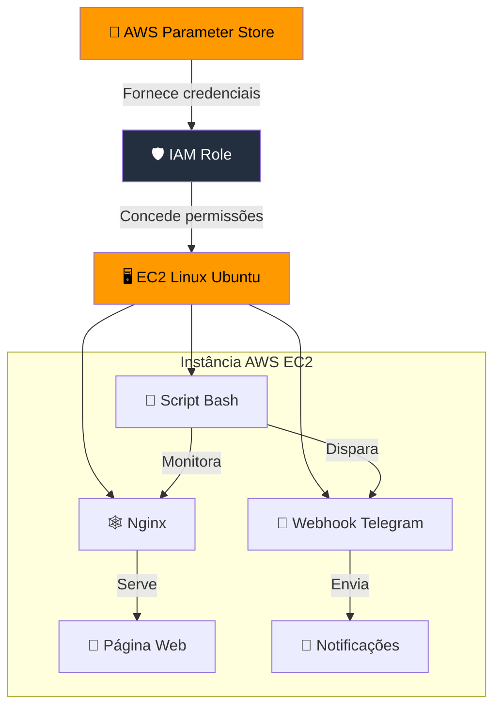

# Sprint 01 - Projeto Linux com Servidor Web na AWS e Monitoramento Webhook com Telegram
###### Por Rogério Anastácio

## 📝 Descrição

O objetivo desse projeto é implementar um sistema de monitoramento Web com notificações em tempo real. Aplicando os conhecimentos adquiridos em Linux, servidor web usando a estrutura AWS para hospedar os sistemas. É disponibilizado o relatório completo 

 

 A execução do projeto foi dividida em várias etapas: 

1. [**Configuração do Ambiente**](#configuração-do-ambiente)
   - Criação da VPC com 2 Sub-redes Públicas e 2 sub-redes privadas;
   - Configuração e criação de uma instância EC2 na AWS utiliazndo Linux (com uso das VPCs criadas).
2. **Configuração do Servidor Web**
   - Instalação do Nginx;
   - Subir página HTML para o Nginx exibir.
3. **Script de Monitoramento com Webhook**
   - Script Bash que verifica a cada 60 segundos o estado da página (Disponível / Indisponível);
   - Disparo de mensagem pelo Script Bash para o Telegram avisando da indisponibilidade.
4. [**Testes**](#4.Testes)
   - Realização de testes para confirmar o correto funcionamento de toda a implementação.
5. **Desafio Bônus**
    - Criação de Script para ser inserido no campo "Dados de Usuário" durante a criação da instância EC2.
 

### [📄 Acesse aqui o **relatório** final e completo do projeto (em pdf).](documentacao.pdf)

  

### 🔧 Arquitetura de Integração Automatizada com AWS e Telegram
a

## **1. Configuração do Ambiente**
a

## **2.Configuração do Ambiente**
a

## **3.Configuração do Ambiente**
a

## **4.Testes**
b
## **5.Desafio Bônus**

## 📊 Diagrama de Arquitetura do Sistema

##Tecnologias Utilizadas
* Cron
* Linux Ubuntu 24.04
* Nginx (Servidor Web)
* Script Bash
* Serviços de Computação em nuvem AWS (EC2, IAM, Gerenciador de Parâmetros, VPC)
* Telegram Webhook (Bot)

