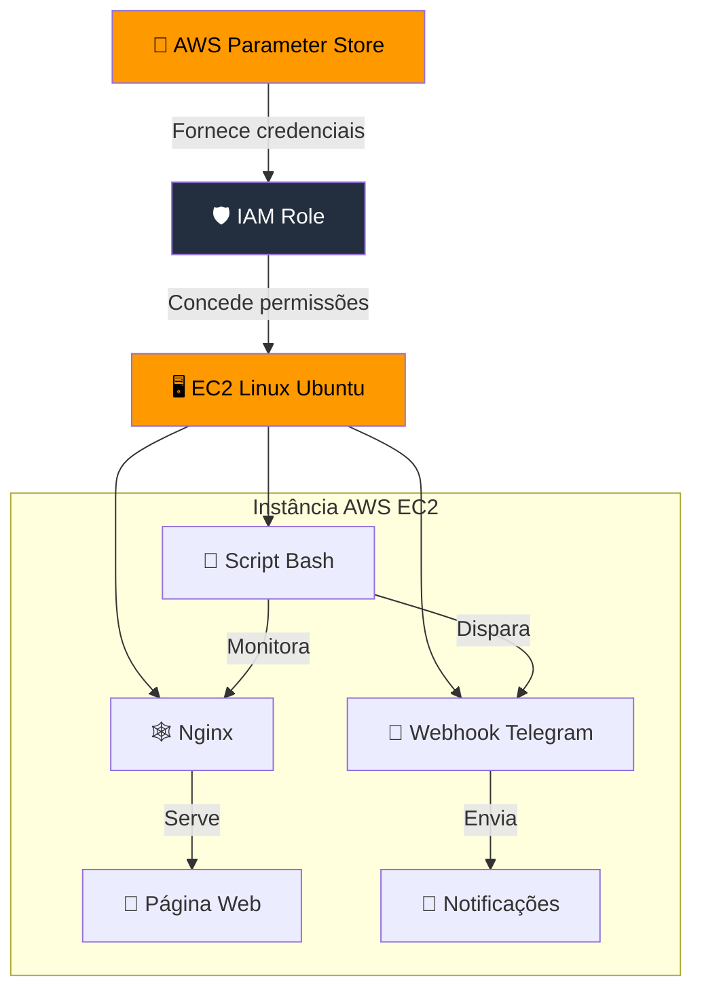

# Sprint 01 - Projeto Linux com Servidor Web na AWS e Monitoramento Webhook com Telegram
###### Por Rogério Anastácio

## 📝 Descrição
<p align="justify">&nbsp;&nbsp;&nbsp;&nbsp; O objetivo desse projeto é implementar um sistema de monitoramento Web com notificações em tempo real. Aplicando os conhecimentos adquiridos em Linux, servidor web usando a estrutura AWS executar o sistema operacional.</p>
<p align="justify">&nbsp;&nbsp;&nbsp;&nbsp;É disponibilizado o relatório completo no link abaixo. </p>

### [📄 Acesse aqui o **relatório** final e completo do projeto (em pdf).](documentacao.pdf)

<br><br><p align="justify">&nbsp;&nbsp;&nbsp;&nbsp; A execução do projeto foi dividida em várias etapas: </p>

1. **Configuração do Ambiente**
   - Criação da **VPC** com 2 sub-redes públicas e 2 sub-redes privadas;
   - Adicionado ao **Repositório de Parâmetros** as informações sensíveis (token e chat_id do telegram);
   - Criado perfil no **IAM** para acessar os parâmetros armazenados;
   - Configuração e criação de uma instância **EC2** na **AWS** utilizando **Linux** (com uso das *VPCs* criadas).
2. **Configuração do Servidor Web**
   - Instalação do *Nginx*;
   - Carregada página HTML para o *Nginx* exibir.
3. **Script de Monitoramento com Webhook**
   - Criação do *Script Bash* com código responsável por verificar periodicamente o estado da página (Disponível / Indisponível);
   - Agendada rotina no *Cron* para executar o *script* a cada 60 segundos;
   - Disparo de mensagem pelo Script Bash para o Telegram avisando quando a página estiver indisponível.
4. **Testes**
   - Realização de testes para confirmar o correto funcionamento de toda a implementação.
5. **Desafio Bônus**
    - Criação de Script para ser inserido no campo "Dados de Usuário" durante a criação da instância EC2.
<br>


## 📊 Diagrama de Arquitetura do Sistema


## Resumo do projeto:
### 1 Configuração do Ambiente
- VPC
   - Criação da *VPC* na AWS, com bloco IP CIDR/24;
   - Criação de duas sub-redes públicas com bloco IP CIDR/28;
   - Criação de duas sub-redes privadas com bloco IP CIDR/28;
   - Criado *Internet Gateway* e anexado à *VPC*
   - Configuração da tabela de rotas para direcionar todo tráfego de saída ao *internet gateway*
<br>

- Repositório de Parâmetros
     - Armazenamento dos parâmetros do Telegram referente ao *Token* do bot *(Secure String)* e *Chat ID (String)*.

 <br>

- *Identity and Acess Management* (**IAM**)
     - Criado a política para associar os parâmetros do Telegram armazenados.
 
<br>

- EC2
   - Seção **Nome e Tags:** Adicionadas as Tags relacionadas ao projeto;
   - Seção **Imagens de aplicação e de sistema operacional:** Escolhido o Linux Ubuntu como Sistema Operacional;
   - Seção **Par de Chaves (Login):** Criado novo par de chaves (Foi realizado *download* da chave);
   - Seção **Configuração de Rede:** Seleção da VPC criada, com uma das sub-redes públicas. Habilitada a atribuição de IP público automaticamente;
   - Subseção **Adicionar Regra de Grupo de Segurança:** Abertura das portas, no grupo de segurança (Firewall)
        - SSH: 22;
        - HTTP: 80;
        - HTTPS: 443.
   - Seção **Detalhes Avançados:**
        - Selecionado o Perfil do IAM criado.
   -Finalzada as configurações: Foi Executada a instância e aguardado a inicialização do **Sistema Operacional** para prosseguir.

<br><br>

### 2 Configuração do Servidor Web
<p align="justify">&nbsp;&nbsp;&nbsp;&nbsp; Foi realizado o acesso à instância recém-configurada da AWS a partir de um sistema local com Debian, por meio de conexão SSH. A autenticação foi feita utilizando a chave privada gerada durante a configuração da instância, juntamente com o endereço IP público atribuído.</p><br>

- Instalação do Nginx: Foi instalado o Nginx utilizando o instalador de pacotes padrão *apt*;
   - Após a Instalação foi verificado se o serviço entrou em execução, caso necessário o serviço pode ser iniciado manualmente com `systemctl start nginx`.
   - Acessado o site padrão do Nginx usando o endereço de IP público da instância.

<br>

- Realizado a cópia do site com o `curl` para substituir a página padrão do Nginx e armazenado no repositório do **GitHub** e armazenado no diretório `/tmp/`.
  ```bash
  curl -L "https://github.com/master-rogerio/CompassUol_PB_2025/raw/refs/heads/main/Sprint01/site.zip" -o "/tmp/site.zip"
  ```
  - O arquivo copiado foi descompactado com o *unzip*. Após descompactar o site foi removido o arquivo copiado da internet.
    ```bash
    unzip -q -o "/tmp/site.zip" -d "/var/www/html/"
    rm -f "/tmp/site.zip"
    ```
  - Foi alterado o dono e o grupo de todos os arquivos para o `www-data` (Usuário padrão do Nginx)
    ```bash
    chown -R www-data:www-data /var/www/html
    ```
  - E depois foi alterado a permissão de todos os diretórios do site para que usuário proprietário pudesse ler, gravar e executar. Enquanto os grupos outros usuários pudessem ler e executar.
    ```bash
    sudo find /var/www/html -type d -exec chmod 755 {} \;
    ```
  - Também foi alterado a permissão dos arquivos para que o proprietário possa ler e escrever enquanto os outros possam somente realizar a leitura.
    ```bash
    sudo find /var/www/html -type f -exec chmod 644 {} \;
    ```
    - Foi acessado novamente o site com o ip público da instância EC2 para verificar se o site que foi inserido já havia ficado disponível pelo Nginx.
<br>
   
  

### 3 Script de Monitoramento com Webhook
&nbsp;&nbsp;&nbsp;&nbsp;Para realizar essa etapa foi escrito o script de monitoramento `monitor_site.sh`, ele foi armazenado em `/usr/local/bin/` e então atribuida a permissão de *execução* dele com `chmod +x /usr/local/bin/monitor_site.sh`. Ele foi usado para verificar a disponibilidade do site, armazenar os registros e disparar a mensagem pelo *bot* do *Telegram* quando o site estiver indisponível. Porém para que esse script consiga acessar as informações que foram armazenadas no Repositório de Parâmetros foi necessário fazer o *download* do pacote **AWS CLI** através do endereço `https://awscli.amazonaws.com/awscli-exe-linux-x86_64.zip` e então assim foi realizado a instalação.

   ```bash monitor_site.sh
   <monitor_site.sh>
   #!/bin/bash
   #Busca Parametros armazenados no Repositorio de Parametros AWS (IAM)
   aws configure set region us-east-1
   TELEGRAM_BOT_TOKEN=$(aws ssm get-parameter --name "/telegram/bot_token" --with-decryption --query "Parameter.Value" --output text)
   TELEGRAM_CHAT_ID=$(aws ssm get-parameter --name "/telegram/chat_id" --query "Parameter.Value" --output text)

   # Configurações do Telegram
   BOT_TOKEN="$TELEGRAM_BOT_TOKEN"
   CHAT_ID="$TELEGRAM_CHAT_ID"

   SITE_URL="http://$(curl -s https://checkip.amazonaws.com/)" # Busca Ip Publico

   response=$(curl -s -o /dev/null -w "%{http_code}" $SITE_URL) # Verifica resposta do site

   timestamp=$(date "+%Y-%m-%d %H:%M:%S") #Variavel que armazena Data e Hora atual

   if [ "$response" -eq 200 ]; then
       echo "[$timestamp] Site $SITE_URL está respondendo normalmente. Código: $response" >> /var/log/monitor_site.log
else
       echo "[$timestamp] ALERTA: $SITE_URL não está respondendo. Código: $response" >> /var/log/monitor_site.log
    
       # Envia mensagem para o Telegram
       message="🚨 *ALERTA DE MONITORAMENTO* 🚨
    
       O site está Offline!
    
	    *IP:* $SITE_URL
       *Código HTTP:* $response
       *Hora:* $timestamp"
    
       curl -s -X POST \
           "https://api.telegram.org/bot$BOT_TOKEN/sendMessage" \
           -d chat_id="$CHAT_ID" \
           -d text="$message" \
           -d parse_mode="Markdown" >> /dev/null
   fi

   ```
<br>

   - Esse script verifica se o site está disponível fazendo a requisição do código http do site com o`curl`. Caso retornado o código *200* significa que o site está online e caso diferente é enviado uma mensagem pelo *bot do Telegram* avisando dessa indisponibilidade. Esse script faz escrita no log a cada 60 segundos, com o código http retornado.
   - O *Cron* é utilizado para agendar a execução do script, sendo chamado por `crontab -e`. Foi escrito o seguinte código nele:
   ```
      * * * * * /usr/local/bin/monitor_site.sh"
   ```

<b>
	
### 4 Testes
&nbsp;&nbsp;&nbsp;&nbsp; Para verificar se todos os recursos estavam funcionando conforme necessário. Inicialmente foi verificado se o script `monitor_site.sh` estava escrevendo no *log*, armazenado em `var/log` com o nome de `monitor_site.log`, uma vez por minuto. E depois foi usado o comando `systemctl stop nginx.service` para encerrar o &nbsp;&nbsp;&nbsp;&nbsp; serviço *Nginx*. E assim é esperado que a partir da próxima execução agendada do script seja disparada uma mensagem para o *bot* do *Telegram*.
Após algum tempo é reiniciado o *nginx* com o comando `systemctl start nginx` e também acompanhado no registro `monitor_site.log` se tudo foi registrado conforme esperado.


<br>
	


<br>

&nbsp;&nbsp;&nbsp;&nbsp; Portanto, de acordo com as imagens, foi verificado que o sistema funcionou conforme era esperado, armazenando mensagens no *log* personalizada de acordo com a disponibilidade da página e também realizado o envio de mensagem pelo *bot* quando a página está indisponível.

### 5 Desafio Bônus
&nbsp;&nbsp;&nbsp;&nbsp; Foi criado um *script Bash* para que pudesse ser realizado toda a configuração do ambiente Linux da instância EC2 após a sua criação.<br>

- Esse script instala todas as dependências necessárias no Ubuntu, copia o site criado e modifica as permissões dos arquivos, cria o script de monitoramento e realiza o agendamento para que o script `monitor_site.sh` seja executado periodicamente.

```bash UserDataScript.sh
#!/bin/bash
# Atualiza o sistema, instala o Nginx e dependências adicionais.
sudo apt-get update -y; sudo apt-get upgrade -y; sudo apt-get install -y nginx curl cron unzip;

# Inicia e habilita o Nginx
sudo systemctl start nginx
sudo systemctl enable nginx

# Troca o Timezone para Brasil
sudo timedatectl set-timezone America/Sao_Paulo


# ------- Baixa Site para usar no Nginx -------

sudo curl -L "https://github.com/master-rogerio/CompassUol_PB_2025/raw/refs/heads/main/Sprint01/site.zip" -o "/tmp/site.zip"

sudo unzip -q -o "/tmp/site.zip" -d "/var/www/html/"

sudo rm -f "/tmp/site.zip"

# Ajusta Permissões
sudo chown -R www-data:www-data /var/www/html
sudo find /var/www/html -type d -exec chmod 755 {} \;
sudo find /var/www/html -type f -exec chmod 644 {} \;

##-------- Fim Site --------


# --- AWSCLI Config Install ----
# Baixa o instalador oficial AWSCLI
sudo curl "https://awscli.amazonaws.com/awscli-exe-linux-x86_64.zip" -o "/tmp/awscliv2.zip"

# Descompacta
sudo unzip -q /tmp/awscliv2.zip -d /tmp

# Instala AWSCLI
sudo /tmp/aws/install --bin-dir /usr/local/bin --install-dir /usr/local/aws-cli --update

sudo rm -rf /tmp/aws /tmp/awscliv2.zip
## --------- FIM Configuração AWSCLI --------


## Cria SCRIPT de monitoramento Telegram
cat <<'EOF' > /usr/local/bin/monitor_site.sh
#!/bin/bash

aws configure set region us-east-1

TELEGRAM_BOT_TOKEN=$(aws ssm get-parameter --name "/telegram/bot_token" --with-decryption --query "Parameter.Value" --output text)
TELEGRAM_CHAT_ID=$(aws ssm get-parameter --name "/telegram/chat_id" --query "Parameter.Value" --output text)

# Configurações do Telegram
BOT_TOKEN="$TELEGRAM_BOT_TOKEN"
CHAT_ID="$TELEGRAM_CHAT_ID"
SITE_URL="http://$(curl -s https://checkip.amazonaws.com/)" # Busca Ip Publico

# Verifica resposta do site
response=$(curl -s -o /dev/null -w "%{http_code}" $SITE_URL)
timestamp=$(date "+%Y-%m-%d %H:%M:%S")

if [ "$response" -eq 200 ]; then
    echo "[$timestamp] Site $SITE_URL está respondendo normalmente. Código: $response" >> /var/log/monitor_site.log
else
    echo "[$timestamp] ALERTA: $SITE_URL não está respondendo. Código: $response" >> /var/log/monitor_site.log
    
    # Envia mensagem para o Telegram
    message="🚨 *ALERTA DE MONITORAMENTO* 🚨
    
    O site está Offline!
    
	*IP:* $SITE_URL
    *Código HTTP:* $response
    *Hora:* $timestamp"
    
    curl -s -X POST \
        "https://api.telegram.org/bot$BOT_TOKEN/sendMessage" \
        -d chat_id="$CHAT_ID" \
        -d text="$message" \
        -d parse_mode="Markdown" >> /dev/null
fi
EOF


# Tornar o script executável
chmod +x /usr/local/bin/monitor_site.sh

## Configuração do cron job para executar a cada minuto
(crontab -l 2>/dev/null; echo "* * * * * /usr/local/bin/monitor_site.sh") | crontab -

# Mensagem final
echo "Configuração inicial concluída. Realizada pelo User Data em: $(date)" > /var/log/monitor_site.log
```

<br>

&nbsp;&nbsp;&nbsp;&nbsp;Para que esse script funcione basta iserí-lo no campo "Dados de Usuário" localizado na seção **Detalhes Avançados** durante a criação da instância EC2.


<br>

## Tecnologias Utilizadas
* Cron
* Linux Ubuntu 24.04
* Nginx (Servidor Web)
* Script Bash
* Serviços de Computação em nuvem AWS (EC2, IAM, Gerenciador de Parâmetros, VPC)
* Telegram Webhook (Bot)

