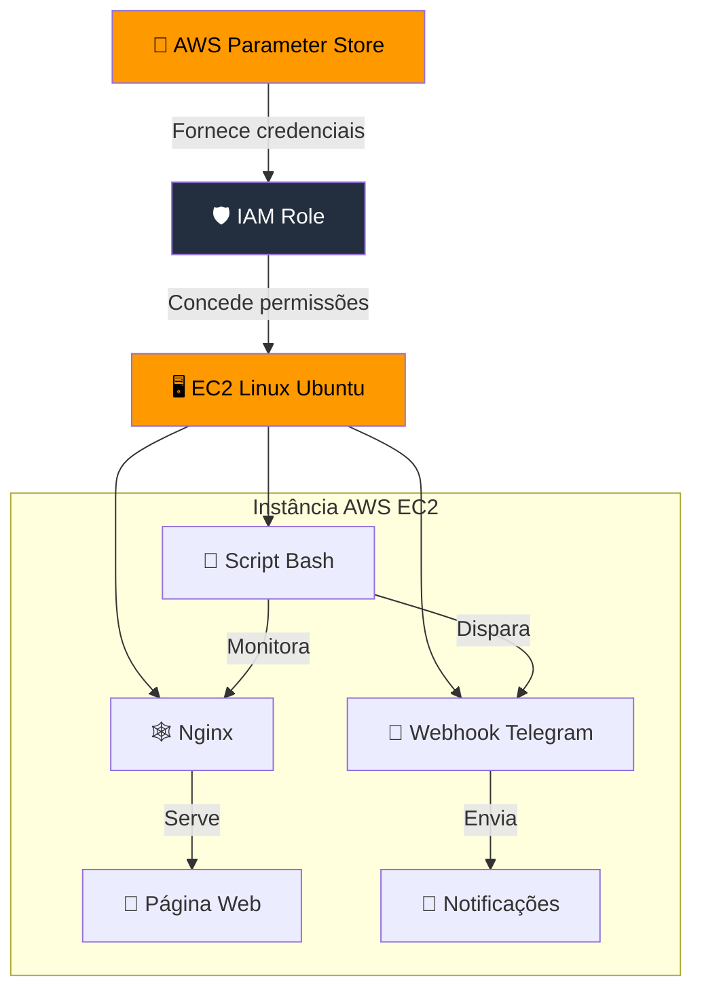

# Sprint 01 - Projeto Linux com Servidor Web na AWS e Monitoramento Webhook com Telegram
###### Por Rogério Anastácio

## Descrição
O objetivo desse projeto é aprofundar os conhecimentos em Linux, servidor web com o uso de estrutura AWS para hospedar os sistemas.

[📄 Acesse o relatório final](documentacao.pdf)

### 🔧 Arquitetura de Integração Automatizada com AWS e Telegram
a

## Estrutura do Projeto

## 📊 Diagrama de Arquitetura do Sistema

##Tecnologias Utilizadas
* Cron
* Linux Ubuntu 24.04
* Nginx (Servidor Web)
* Script Bash
* Serviços de Computação em nuvem AWS (EC2, IAM, Gerenciador de Parâmetros, VPC)
* Telegram Webhook (Bot)

